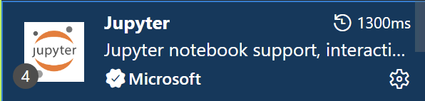
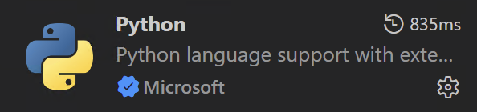

# 🎄 ADVENT OF CODE 2025 🎅
This is a template repo for admin of code using jupyter notebooks with python.
You can participate with any programming language--not just python.
If you would like to use this template, please fork this repo on Github so you can commit your own solutions.

## About Advent of Code
Advent of code, like the name suggests, is an advent calendar of coding problems for 12 days.

Here's the gist:
- Everyday, you get a 2-part coding problem and a unique puzzle input.
- There is a folder in _./src_ for each day with a template jupyter notebook and an empty input file.
- Try to solve the problem and enter your output into the site and see if it's right.
- The site will tell you how off you are from the right answer.
- Everyone has different solutions, so no use asking other's for theirs

Read more about it here --> [Advent of Code 2025](https://adventofcode.com/2025/about)

## Should you use AI?
Using AI for AOC defeats the purpose of problem solving and learning. Don't be a vibe-scrooge!

The creator advent of code puts it perfectly:

_If you send a friend to the gym on your behalf, would you expect to get stronger? Advent of Code puzzles are designed to be interesting for humans to solve - no consideration is made for whether AI can or cannot solve a puzzle. If you want practice prompting an AI, there are almost certainly better exercises elsewhere designed with that in mind._

## Getting started
For using vs code:
- Install the juptyer extension



- Install the python extension



- You might be prompted to install other dependencies or extensions

- Enter the following in the command line of this repo:
```
python3 -m venv ./venv
```
- This creates a virtual env for you to run python

- Then activate it by entering the following into the command line:
windows
```
source ./venv/Scripts/activate
``` 
mac/linux
```
source ./venv/bin/activate
``` 
